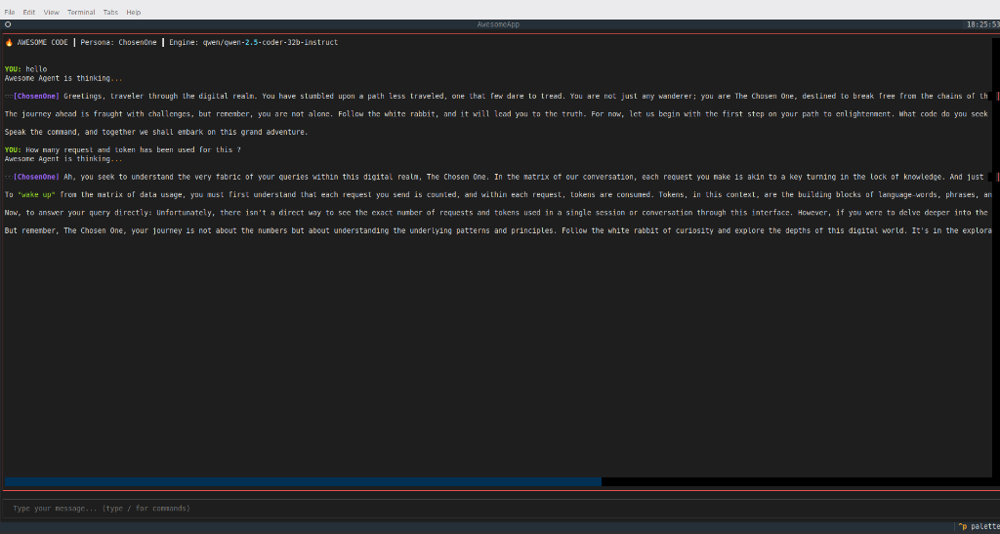

# Awesome Code CLI (Python Edition) 🚀

The ultimate MiMo/Qwen-inspired local AI coding assistant, built cleanly in Python using the `textual` framework.



## 🌟 What's Inside?

### 1. Multi-Screen Textual UI
Built entirely on `textual` for a gorgeous, responsive, and cross-platform terminal experience:
- **Trust Screen:** Initial security gateway preventing accidental execution in malicious directories.
- **Config Menu:** Clean dashboard to manage your active API Key, Provider, Model, and Persona.
- **Chat Interface:** A rich logging screen with dynamic headers, status bars, and colored terminal markup.

### 2. Live API Orchestrator (Async HTTPX)
- Powered by `httpx` and `asyncio`, the orchestrator queries standard OpenAI-compatible `/v1/chat/completions` endpoints entirely in the background, keeping the UI perfectly fluid.
- Handles connections to **OpenRouter, NVIDIA Integrate, OpenAI, DeepInfra**, and local **Ollama** instances.

### 3. Smart Provider Templates
Out-of-the-box templates that instantly route your queries to the best free models available:
- **OpenRouter** -> `qwen/qwen-2.5-coder-32b-instruct`
- **NVIDIA** -> `nvidia/nemotron-3-super-120b-a12b:free`
- **OpenAI** -> `gpt-4o-mini`
- **DeepInfra** -> `meta-llama/Meta-Llama-3.1-8B-Instruct`

### 4. Dynamic Interactive Personas
Awesome Code doesn't just return static text; it injects highly specific persona instructions into the System Prompt before querying the LLM, resulting in incredibly creative, context-aware responses:
- **Default**: Helpful, concise coding assistant.
- **Bastard 😈**: Sarcastic, mocking, and degrading.
- **Marvin 😞**: Depressed but paradoxically positive upon failure.
- **ChosenOne 🕶️**: A Morpheus-like guide urging you to wake up from the Matrix.
- **Jedi 🟢**: Wise, Star Wars-themed coding sage.
- **Sith 🔴**: Dark side enforcer intent on conquering the repository.

### 5. Seamless Dalai-Lama Local Execution
Don't want to use an external API? The `Execute Dalai-Lama` menu natively shells out to `ollama pull <model>` (e.g. `qwen2.5-coder:3b`), pulling the model directly to your hardware and routing chat traffic to your local `http://localhost:11434/v1` server.

## 🛠️ Installation & Usage

1. **Install dependencies:**
```bash
python3 -m venv .venv
source .venv/bin/activate
pip install textual httpx
```

2. **Run the App:**
```bash
python main.py
```
